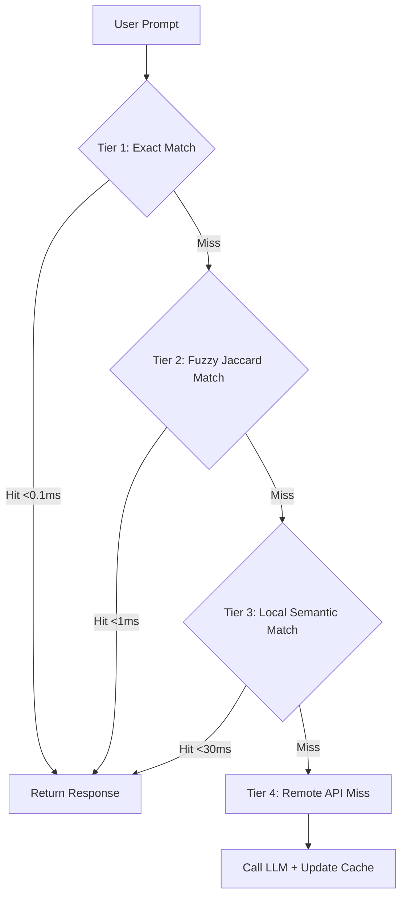

# 🧠 SemCache

A high-performance, **zero-cost, low-latency tiered semantic caching SDK** for LLMs running local embeddings. 

SemCache solves the embedding bottleneck of traditional semantic caches by generating embeddings and similarity indexes **completely locally** using quantized ONNX models (`all-MiniLM-L6-v2`) on the client or local server. This avoids network overhead, API charges, and latency, achieving matching lookups in **<30ms at $0 cost**.

---

## 🚀 The 4-Tier Matching Architecture

Standard semantic caches make remote API calls to calculate embeddings, adding $100\text{--}300\text{ms}$ of latency and accumulating token costs even on cache misses. SemCache implements a tiered structure to resolve this:



1. **Tier 1: Exact Match** (`<0.1ms`, `$0` cost)
   * Quick normalized key-value hash lookup (ignores casing, trailing whitespace, and punctuation).
2. **Tier 2: Fuzzy Token Match** (`<1ms`, `$0` cost)
   * Local Jaccard similarity evaluation on word tokens. Perfect for typos or minor word insertions.
3. **Tier 3: Local Semantic Match** (`15-40ms`, `$0` cost)
   * Lazy-loads a local quantized ONNX embedding model (`all-MiniLM-L6-v2`) to run cosine similarity comparisons.
4. **Tier 4: Remote API / Miss** (Incurs standard LLM cost & latency)
   * Served from your choice of LLM provider. The prompt, response, and calculated local embedding vector are then cached to IndexedDB, Memory, or local storage.

---

## 🛠️ Supported Packages

SemCache is distributed as native SDKs for the two major AI development ecosystems:

| SDK Package | Language | Key Features | Quick Start |
| :--- | :--- | :--- | :--- |
| **[`semcache-js`](./js)** | JavaScript / TypeScript | Node & Browser support, built-in Vercel/Stripe-styled **Real-time Dev Dashboard** with a force-directed vector space simulator. | `npm install semcache` |
| **[`semc`](./python)** | Python (3.8+) | Built for FastAPI, LangChain, and LlamaIndex. Powered by `sentence-transformers`. | `pip install semc` |

---

## 📊 Developer Dashboard Console (JS SDK)
The JavaScript SDK includes a zero-dependency local developer console. It features:
* **Interactive Sandbox**: Test queries and see live match latency and cost evaluations.
* **Vector Space Map**: Live force-directed node diagram showing where user prompts sit relative to each other (prompts pull together based on cosine similarity).
* **Live Telemetry**: Track hit/miss metrics, cost saved, and latency saved.

To launch the dashboard server in JS:
```typescript
import { SemCache } from 'semcache';
const cache = new SemCache();
cache.startDevServer(3000); // Launches server at http://localhost:3000
```
